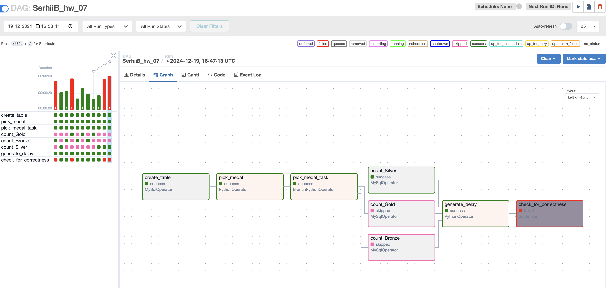
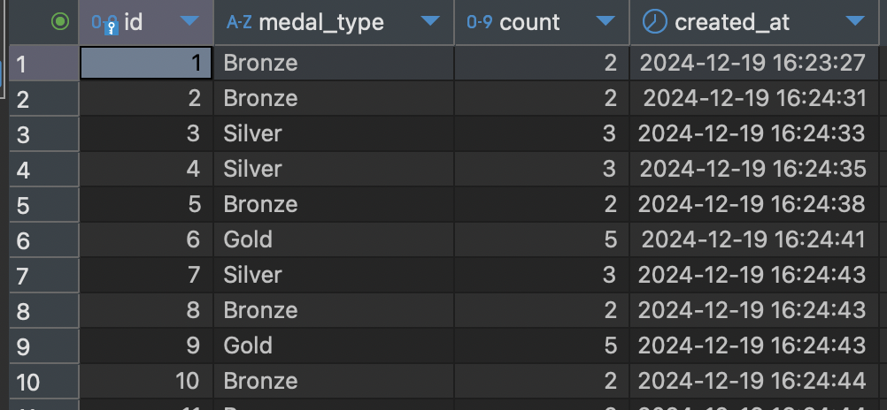
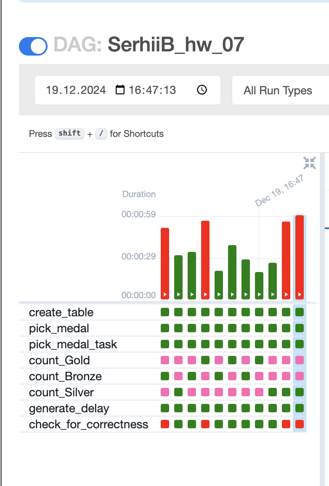

## Опис DAG у Airflow

Цей DAG (`SerhiiB_hw_07`) автоматизує процес створення таблиці для медалей, випадкового вибору медалі, підрахунку кількості медалей у базі даних MySQL та перевірки наявності записів, створених у певний проміжок часу.

### Структура DAG

1. **`create_table`**:  
   Створює таблицю `medals` у базі даних MySQL, якщо вона ще не існує.

2. **`pick_medal`**:  
   Випадковим чином обирає один із трьох типів медалей: `Gold`, `Silver` або `Bronze`.

3. **`pick_medal_task`**:  
   Визначає наступний крок залежно від типу медалі, обраної на попередньому кроці (`count_Gold`, `count_Silver`, `count_Bronze`).

4. **`count_Gold`, `count_Silver`, `count_Bronze`**:  
   Підраховують кількість медалей відповідного типу в таблиці `athlete_event_results` і додають результат у таблицю `medals`.

5. **`generate_delay`**:  
   Генерує випадкову затримку від 5 до 45 секунд перед перевіркою результатів.

6. **`check_for_correctness`**:  
   Перевіряє, чи були медалі додані до таблиці за останні 30 секунд.

### Візуалізація DAG

1. **Скріншот 1: Гістограма виконання завдань**  
   Показує тривалість виконання кожного завдання. Зелені блоки означають успішне виконання, червоні — помилки.

2. **Скріншот 2: Дані у таблиці `medals`**  
   Містить записи з підрахунком медалей після виконання DAG.

3. **Скріншот 3: Граф виконання DAG**  
   Показує структуру DAG з усіма завданнями та їх статусами:
   - **Зелені блоки** — успішні завдання.
   - **Рожеві блоки** — пропущені завдання.
   - **Червоні блоки** — завдання, які завершилися з помилкою.

---

### Як запустити DAG

1. **Розгорніть Airflow з MySQL**.
2. Додайте DAG-файл до папки `dags`.
3. Створіть з'єднання `SerhiiB_mysql` в Airflow UI:
   - **Connection ID**: `SerhiiB_mysql`
   - **Connection Type**: `MySQL`
   - **Host**: `mysql`
   - **Schema**: `SerhiiB`
   - **Login**: `airflow`
   - **Password**: `airflow`
4. Запустіть DAG через Airflow UI.

---

Цей DAG допомагає автоматизувати процес підрахунку медалей на основі даних у базі MySQL та забезпечує моніторинг виконання завдань.